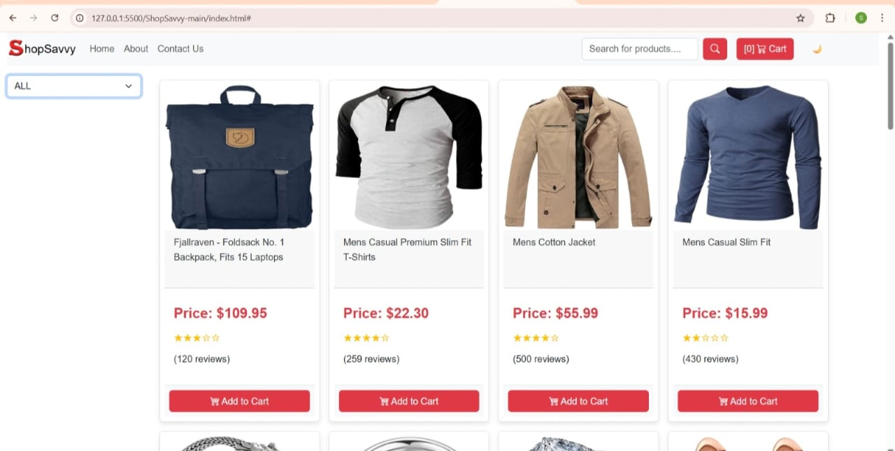
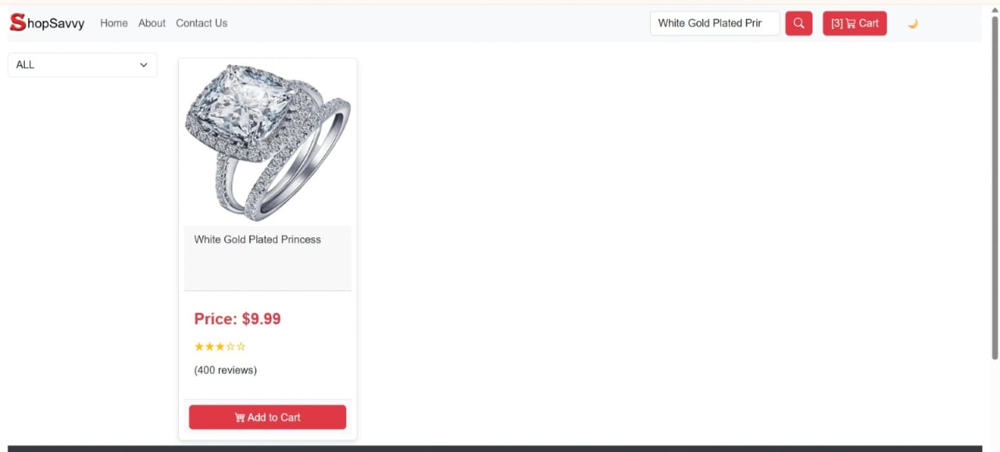
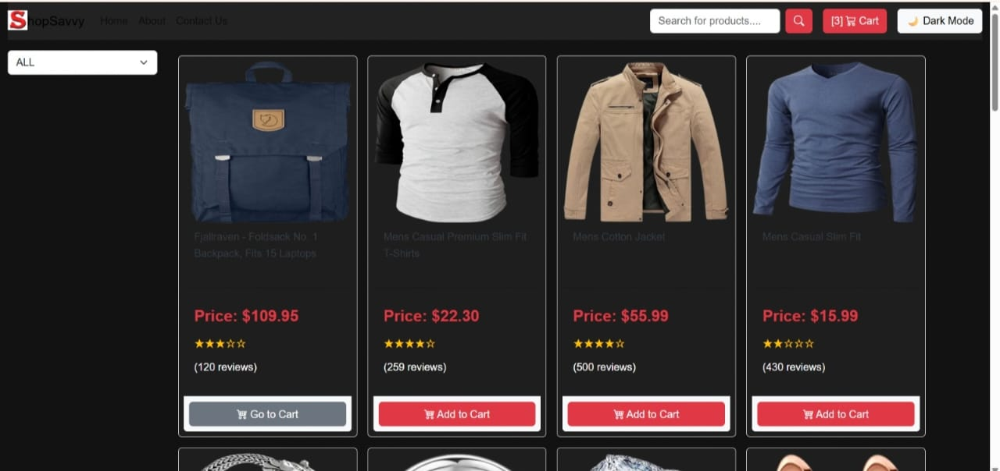
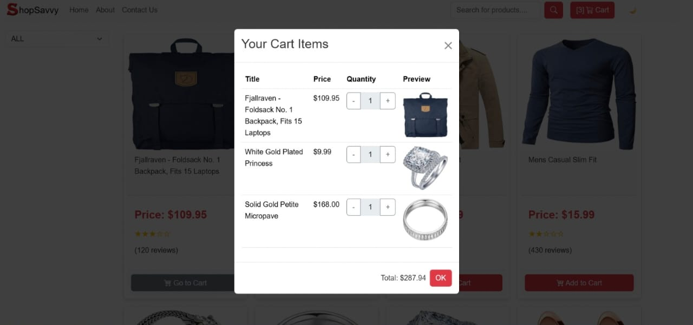

# 🛒 ShopSavvy

ShopSavvy is a responsive e-commerce website that fetches product data from the Fake Store API and provides a smooth shopping experience.  
Built with **HTML, CSS (Bootstrap), and JavaScript**, it includes dynamic product listings, a shopping cart, category filter, dark mode, and a search option.


## 🚀 Features
- 📦 Dynamic Product Listing (from Fake Store API)
- 🛍️ Shopping Cart with Add/Remove functionality
- 📂 Category-based Filtering
- 🌙 Dark Mode with user preference saved
- 🔍 Live Product Search
- 📱 Responsive design using Bootstrap


## 🖼️ Screenshots

### 🏠 Homepage
, and JavaScript**, it includes dynamic product listings, a shopping cart, category filter, dark mode, and a search option.


## 🚀 Features
- 📦 Dynamic Product Listing (from Fake Store API)
- 🛍️ Shopping Cart with Add/Remove functionality
- 📂 Category-based Filtering
- 🌙 Dark Mode with user preference saved
- 🔍 Live Product Search
- 📱 Responsive design using Bootstrap


## 🖼️ Screenshots

### 🏠 Homepage
, and JavaScript**, it includes dynamic product listings, a shopping cart, category filter, dark mode, and a search option.


## 🚀 Features
- 📦 Dynamic Product Listing (from Fake Store API)
- 🛍️ Shopping Cart with Add/Remove functionality
- 📂 Category-based Filtering
- 🌙 Dark Mode with user preference saved
- 🔍 Live Product Search
- 📱 Responsive design using Bootstrap


## 🖼️ Screenshots

### 🏠 Homepage


### 🔍 Search Feature


### 🌙 Dark Mode


### 🛒 Cart


---

## 🛠️ Tech Stack
- **Frontend:** HTML, CSS, Bootstrap
- **Logic:** JavaScript (Vanilla)
- **API:** [Fake Store API](https://fakestoreapi.com/)


## 📂 Project Setup
1. Clone the repo:
   ```bash
   git clone https://github.com/your-username/ShopSavvy.git
screenshots/homepage.jpeg)
